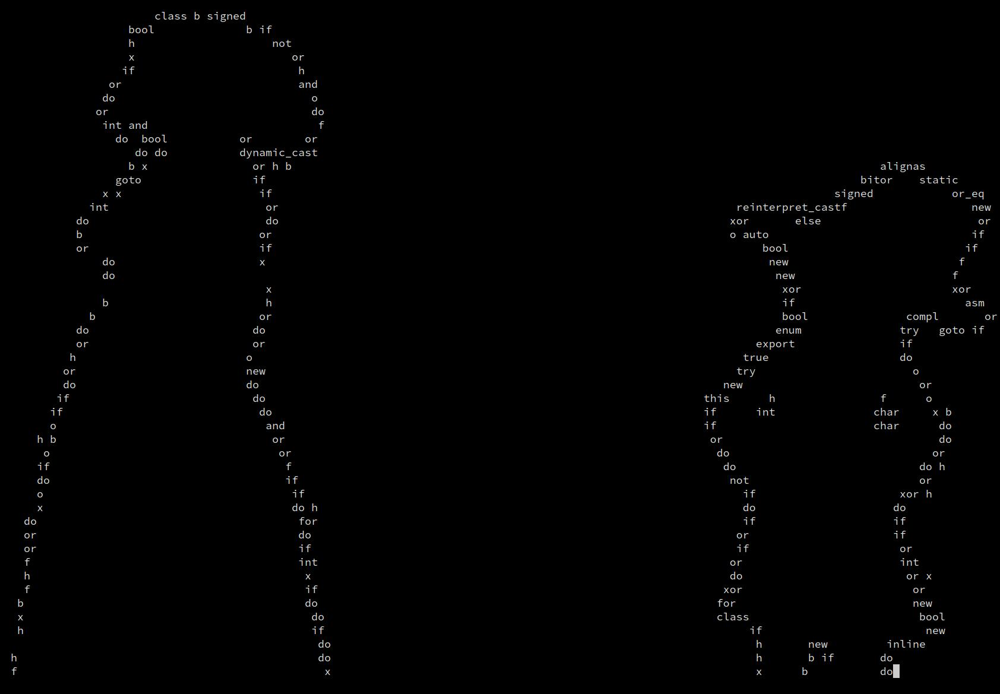

# ASCII render

1. read tokens
2. read GIF frames
3. put tokens where frame exceeds some tone threshold
4. ???
5. profit

[YouTube demo](https://www.youtube.com/watch?v=ZaW37nEcPQM).

This project depends on [crossterm](https://docs.rs/crossterm/latest/crossterm/)
for terminal-independent cursor movement, [gif](https://crates.io/crates/gif) to
parse the GIF, and [rand](https://crates.io/crates/rand) for selecting a random
token.
